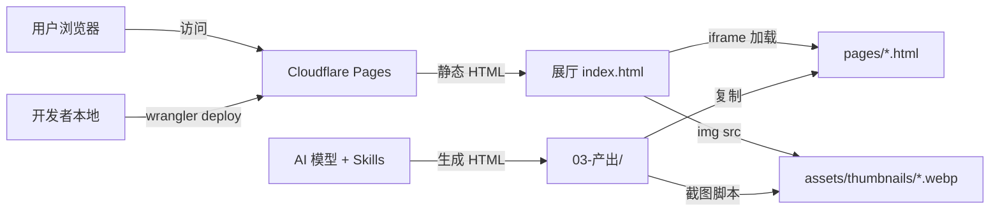

# 系统架构

## 架构总览



本项目是**完全静态**的 Web 应用，无后端服务、无数据库、无运行时 AI 调用。

**数据流向**：
1. AI 模型（Kimi/Gemini/DeepSeek/GLM/GPT 等）在 design skill 驱动下生成 HTML 页面 → 存入 `03-产出/` 目录
2. HTML 文件复制到 `cloudflarepage展厅/pages/`，运行截图脚本生成缩略图 → 存入 `assets/thumbnails/*.webp`
3. 开发者通过 Wrangler CLI 将展厅目录部署到 Cloudflare Pages
4. 用户通过 `https://frontend-design-skills-showcase.pages.dev` 访问展厅，按模型/场景/技能筛选浏览

## GLM 5.2 补测说明（2026-06-17）

- **背景**：系统内置 GLM 为 5.1（原 GLM 5.0，展厅已改名），需补测 GLM 5.2 以横向对比两个版本差异
- **隔离实现**：通过 14 个 subagent 并行生成，每个 subagent 仅读 1 个 skill 的 SKILL.md + 3 个场景文档，无上下文/无技能污染
- **产出位置**：`03-产出/glm5.2/`，共 42 个 HTML（14 skill × 3 场景）
- **命名规则**：`glm5.2-{skill}-{airline|charging|bikeops}.html`
- **生成规范**：`02-输入/_glm5.2-生成规范.md`
- **当前状态**：HTML 生成 ✅；展厅集成 ✅；截图入库 ✅；部署 ✅
- **展厅入口**：https://frontend-design-skills-showcase.pages.dev（CDN 缓存未刷新时可用别名 https://production.frontend-design-skills-showcase.pages.dev）

## Hy3（助手自驱）加测说明（2026-07-12）

- **背景**：将本项目 AI 助手自身作为第 11 个"模型"参与横评，观察助手自驱在同一批 design skill 下的成色。
- **隔离实现**：沿用 14 个 subagent 并行方案，每个 subagent 完全隔离（不携带主上下文、不引入其他 skill），只读 1 个 skill 的 SKILL.md + 3 个场景文档。因这 14 个 skill 不在 WorkBuddy 技能注册表，"只暴露 1 个 skill" 通过把该 SKILL.md 内容嵌入 subagent prompt 实现。
- **产出位置**：`03-产出/hy3/`，共 42 个 HTML（14 skill × 3 场景）
- **命名规则**：`hy3-{skill}-{airline|charging|bikeops}.html`
- **生成规范**：`02-输入/_hy3-生成规范.md`（fork 自 `_glm5.2-生成规范.md`）
- **调度坑**：后台 subagent 大量"启动即死"，改用"重跑失败档位（同步返回）"策略补齐 42 页。
- **当前状态**：HTML 生成 ✅；展厅集成 ✅；截图入库 ✅；部署 ✅
- **stitch-design 改名**：展示名 → 「Stitch 提示词增强」（本环境未接通 Google Stitch MCP，实为提示词增强层；id/文件前缀/映射不变）

## 目录结构

```
01-前端设计技能测评/
├── 01-技能/                          # 14 款 design skill 的定义文件
│   ├── skills来源与安装地址.md       # 安装命令参考
│   ├── 版本锁定.json                 # skill 版本哈希锁定
│   └── 已安装技能/skills/           # 14 个 skill 的 SKILL.md
├── 02-输入/产品说明文档/             # 3 个测试场景的产品需求文档
│   ├── 星空航空公司官网说明文档.md
│   ├── 电动车充电桩小程序产品说明文档.md
│   └── 共享两轮城市运营管理后台说明文档.md
├── 03-产出/                          # 各模型的 HTML 产出（核心数据，13 个目录）
│   ├── kimi2.5/                      # Kimi 2.5 (45 页，原 kimi/)
│   ├── mimoV2omni/                   # Mimo V2 Omni (37 页)
│   ├── glm5.1/                       # GLM 5.1 (40 页，原 glm/)
│   ├── gemini3/                      # Gemini 3 (42 页)
│   ├── mimoV2.5/                     # Mimo V2.5 (42 页)
│   ├── minimaxM3/                    # MiniMax M3 (42 页)
│   ├── deepseek/                     # DeepSeek V4 Flash0731 (42 页，已重做)
│   ├── kimi-k2.6/                    # Kimi K2.6 (42 页)
│   ├── kimi-k3/                      # Kimi K3 (12 页，4 skill × 3 场景)
│   ├── qwen3.7-plus/                # Qwen 3.7 Plus (42 页)
│   ├── glm5.2/                       # GLM 5.2 (42 页)
│   ├── hy3/                          # Hy3 助手自驱 (42 页)
│   └── gpt5.6-terra/                 # GPT-5.6 Terra (42 页)
├── cloudflarepage展厅/                     # 展厅静态站点（部署单元）
│   ├── index.html                    # 主页面，含模型/场景/技能筛选逻辑（已注册 13 个模型）
│   ├── view.html                     # 单页预览器
│   ├── pages/                        # HTML 副本（526 文件，含未注册残留）
│   └── assets/thumbnails/            # 540 张 webp 缩略图（2026-07 起从 png 改为 webp）
├── projectdoc/                       # 本项目交接文档（本套件 + 手工《交接文档.md》《部署记录.md》）
├── ScreenShot/                       # 开发过程中的验证截图
└── TempScr/                          # 临时脚本
```

## 技术选型与路线

**为什么用纯静态 HTML 而不是 React/Vue？**
本项目的核心产出是 AI 模型生成的 HTML 页面，这些页面本身就是静态文件。展厅只需要一个 index.html 来组织和展示这些文件，无需构建工具或框架。Tailwind CSS 通过 CDN 引入，零配置。

**为什么用 Cloudflare Pages？**
- 免费额度充足（纯静态站点）
- 全球 CDN 加速
- Wrangler CLI 支持一键部署
- 无需服务器运维

## 外部资源依赖

| 类型 | 资源 | 说明 |
|---|---|---|
| CDN | `https://cdn.tailwindcss.com` | Tailwind CSS 运行时，展厅 index.html 使用 |
| CDN | `https://cdn.jsdelivr.net/npm/@iconify-json/*` | 各 HTML 页面中使用的图标库，按需加载 |
| CDN | `https://fonts.googleapis.com` | Google Fonts，各 HTML 页面字体 |

所有 CDN 资源为运行时必需，国内访问可能较慢但不影响功能。如需加速可替换为国内 CDN 镜像。

## AI 工具链

**本次交接文档生成过程中使用的工具**:
- **Skills**: `project-handoff`（交接文档生成与更新）
- **MCP Servers**: 无
- **Agent 类型**: 无（直接执行）

**历史生成过程中使用的工具**:
- **Skills**: 14 款公共 design skill（frontend-design / stitch-design / web-design-guidelines / ui-ux-pro-max 等）
- **Agent 类型**: subagent 并行生成（GLM 5.2 / Hy3 各 14 个隔离 subagent）；Screenshot 脚本（Python + Playwright / Node.js + Playwright）

## 开发环境痕迹

**原开发平台**: Windows 11 Enterprise LTSC 2024

**AI 辅助工具**: Claude Code（用于生成页面、截图、部署等）

**接手方要求**: 任何支持 Python 或 Node.js 的操作系统即可运行本地服务器和截图脚本。部署需要 Cloudflare 账号和 Wrangler CLI。
